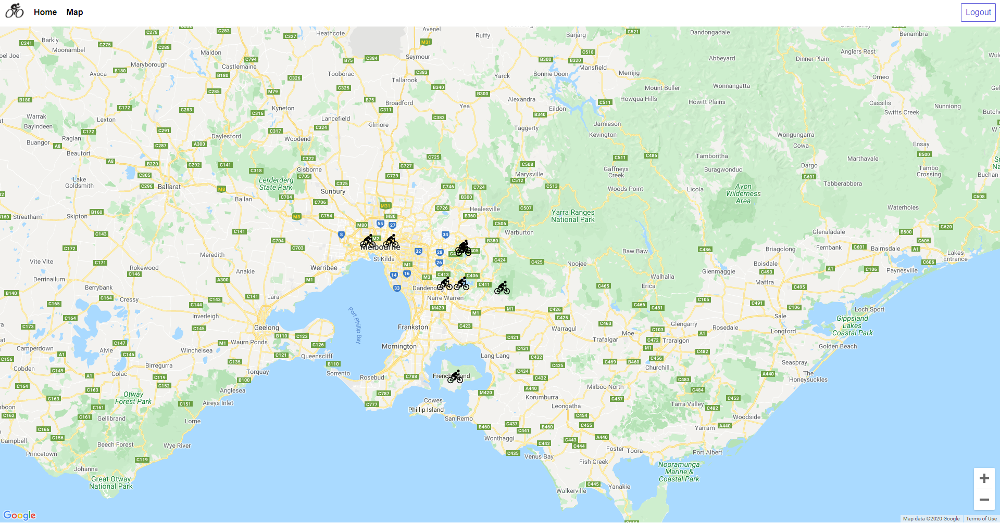

  # Trail Spotter

  ## Description
  

  App for sharing hiking/mountain biking places with other users, simply click on the map to add a location.
  Technology used: MERN Stack, MongoDB (with Mongoose), Express.js, React.js, Node.js

  ## Table of Contents  
  [Installation](#Installation)  
  [License](#License)  
  [Deployed](#Deployed)
  [Demo](#Demo) 
  [Questions](#Questions) 
   

  ## Installation
  npm i to install dependencies and run using node 

  ## License
  MIT

  ## Deployed app
  https://trail-spotter.herokuapp.com/

  ## Demo

  

  ## Questions
  Github: ldipaola
  Email: ldipaola66@gmail.com
